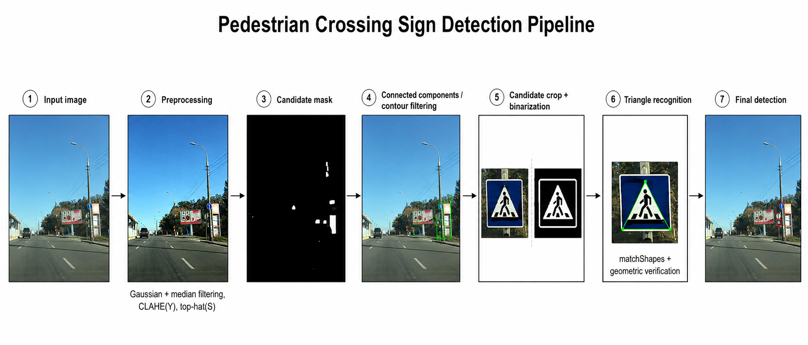
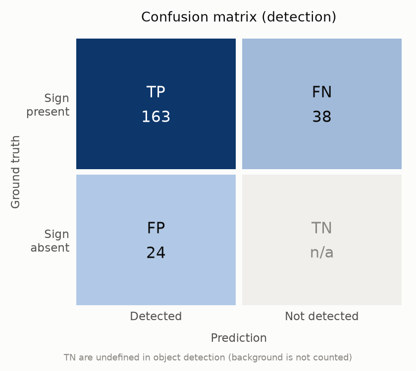
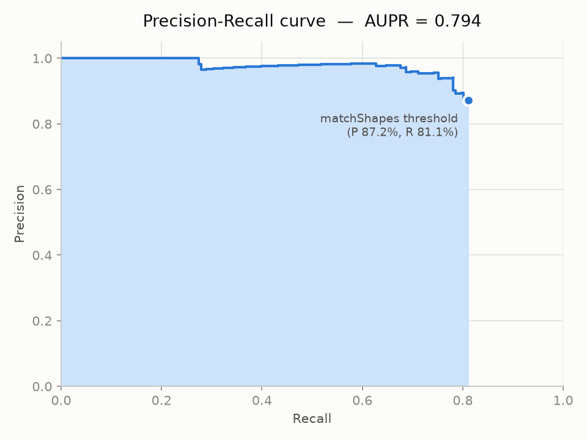
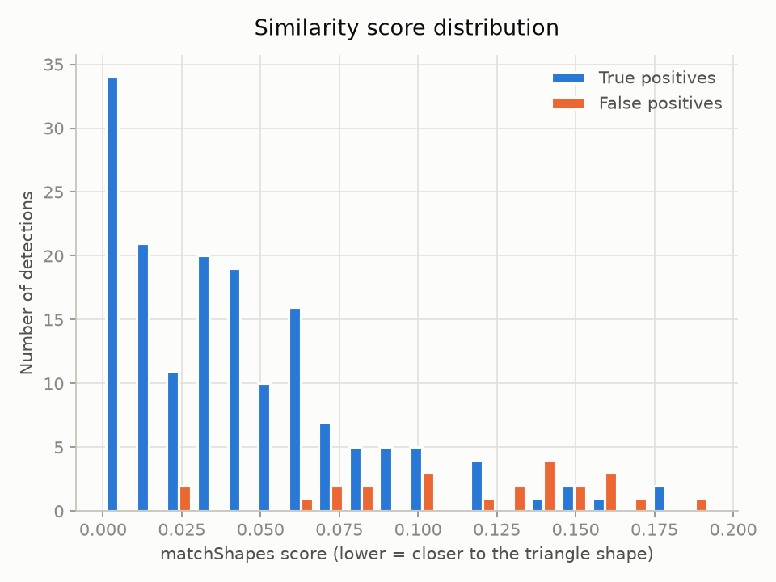

# 🚸 PACE — Pedestrian-crossing Automated Classification Engine



👥 **Team** : Gianmaria D'Agostino, Matteo Di Salvo, Andrea Musumeci, Simone Polselli

🎓 **Project supervisor**: prof. Alessandro Bria

🏛️ Project developed for the **Image Processing & Analysis** course — University of Cassino and Southern Lazio

📜 **Report**: [docs/paper/report.pdf](docs/paper/report.pdf)

---

## 🎯 Goal

Detect **pedestrian crossing signs** (`information--pedestrians-crossing--g1`) in street-level images from the Mapillary Traffic Sign dataset, using only classical image processing techniques with OpenCV (no deep learning). This project is the Python port of the original project developed in C++.

## ⚙️ How the pipeline works

1. 🧹 **Preprocessing** of the full image: Gaussian and median smoothing, CLAHE on the V channel (HSV), top-hat transform on the S channel, binarization in the Lab color space (`inRange`) and morphological closing.
2. 🧩 **Connected components**: extraction of the external contours of the binary mask; candidates are filtered by **area** (2,000 – 100,000 px²) and **rectangularity** (contour area / min-area-rect area > 0.4).
3. ✂️ **Crop** of each candidate, binarized with one of two methods:
   - **Method 1**: candidate contours are first outlined in blue on the image (the outline becomes a dark border in grayscale and helps isolate the pictogram), then CLAHE on the V channel, grayscale top-hat, Otsu threshold;
   - **Method 2** (default): top-hat on the S (saturation) channel, Otsu threshold, inversion.
4. 🔺 **Triangle recognition**: contours inside the crop are filtered by area (500 – 30,000 px²), compared against a triangle template with `cv2.matchShapes` (threshold 0.13 for method 1, 0.2 for method 2) and verified geometrically (`approxPolyDP` down to 3 vertices, similar side lengths, angles within ±28° of 60°).
5. 📏 **Evaluation**: each detection is compared with the ground-truth bounding boxes from the JSON files via Intersection over Union (threshold 0.2); TP, FP, FN, precision, recall and AUPR are computed.

## 📁 Repository structure

```text
pace/
├── 📄 README.md
├── 📄 requirements.txt                 # pip dependencies
├── 📄 environment.yml                  # conda environment
├── 📂 data/
│   ├── raw/subset-IPA-AIA-crossing/    # course dataset: 155 .jpg images + .json annotations
│   ├── heldout-keys.txt                # frozen keys of the 1188 held-out MTSD images
│   └── templates/triangle_template.png # triangle template for matchShapes
├── 📂 docs/                            # README images (banner, plots)
│   └── paper/                          # compiled report (PDF)
├── 📂 results/                         # output: CSV, plots, annotated images (git-ignored)
└── 📂 src/
    ├── main.py            # entry point (CLI)
    ├── config.py          # default paths and pipeline parameters
    ├── annotations.py     # JSON annotation parsing (ground truth)
    ├── preprocessing.py   # candidate mask and crop binarization
    ├── detection.py       # detection pipeline
    ├── geometry.py        # IoU, rectangularity, triangle test
    ├── evaluation.py      # TP/FP/FN metrics and CSV export
    ├── plots.py           # confusion matrix, PR curve (AUPR), score distribution
    ├── build_heldout_set.py  # extract the held-out set from the MTSD archives
    └── funnel_analysis.py    # stage-by-stage analysis of where signs are lost
```

## 🛠️ Installation

Requires Python ≥ 3.10.

**With conda** (recommended):

```bash
conda env create -f environment.yml
conda activate pace
```

**Or with pip**:

```bash
python3 -m venv .venv
source .venv/bin/activate        # on Windows: .venv\Scripts\activate
pip install -r requirements.txt
```

## 🚀 Usage

From the repository root:

```bash
python src/main.py                   # method 2 (default) on the whole dataset
python src/main.py --method 1        # use method 1
python src/main.py --limit 10        # quick test on the first 10 images
python src/main.py --save-vis        # save annotated images to results/annotated/
python src/main.py --show            # display each annotated image on screen
python src/main.py --no-plots        # skip plot generation
```

At the end, the following files are saved to `results/`:

- 📄 `results.csv` — one row per detection (image, bounding box, `matchShapes` score, TP/FP outcome);
- 📊 `plots/confusion_matrix.png` — detection confusion matrix;
- 📈 `plots/precision_recall_curve.png` — Precision-Recall curve with AUPR;
- 📉 `plots/score_distribution.png` — similarity score distribution for TP and FP.

## 📊 Results

On the full dataset (155 images, 201 annotated signs):

| Method                                          | Precision | Recall |
|-------------------------------------------------|-----------|--------|
| Method 1 — grayscale top-hat                    | 92.00%    | 80.10% |
| Method 2 — saturation top-hat (default)         | 87.17%    | 81.09% |

With method 2, using the `matchShapes` score as confidence, the area under the Precision-Recall curve is **AUPR = 0.794**.







> **Note on generalization.** The pipeline parameters were tuned on these same
> 155 images, so the numbers above measure performance on the development set.
> On a held-out set of 1,188 MTSD images never used during development (keys
> frozen in `data/heldout-keys.txt`, rebuilt with `src/build_heldout_set.py`),
> precision/recall drop to 65.6%/14.5% (method 1) and 52.5%/13.4% (method 2) —
> mainly because 41% of real-world signs are below the minimum candidate area,
> and the hand-tuned thresholds overfit the curated subset
> (`src/funnel_analysis.py` breaks the losses down by pipeline stage). This is
> the expected ceiling of a classical pipeline: at MTSD scale (40,000+
> annotated images), deep learning is the natural continuation of this project.

## 📄 License

This project is licensed under the [MIT License](LICENSE).
